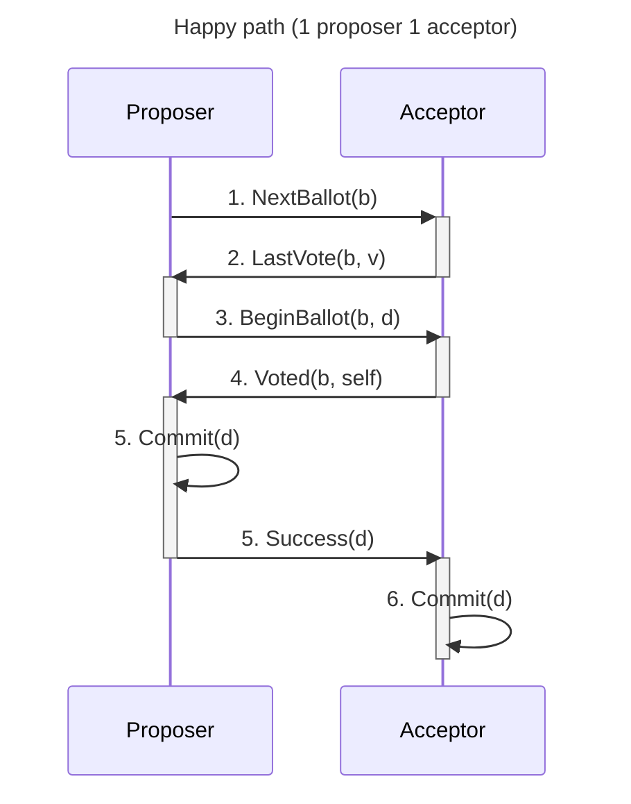

# Paxos

## Introduction

The [original Paxos paper](https://lamport.azurewebsites.net/pubs/lamport-paxos.pdf) explains multiple versions of a single-value consensus protocol called "Single-Decree Synod protocol" (commonly known as _Paxos_), following along with proofs and a story about the fictional island of Paxos ([not this one](https://en.wikipedia.org/wiki/Paxos)).
It later builds upon it to achieve consensus on a ledger.
This last version of the protocol is called "Paxos Parliament's protocol" by the paper, but is commonly known as _Multi-Paxos_.

Here, I'll try to summarize both protocols.

## Paxos, or the Single-Decree Synod protocol

The protocol is based on the reasoning that if we ensure that:

1. each ballot has a unique number
2. the quorums (voting participants) of **any** two ballots have at least one participant in common
3. the value proposed in any ballot is equal to the last one that any quorum participant voted on

Then we are indirectly ensuring that _any two ballots approved by a quorum are for the same value_.
That is to say, whenever consensus is reached, the decision won't ever be reverted.

We can ensure each one of those conditions easily:

1. the ballot number space is divided between participants, so two different ones cannot propose with the same number
2. we always choose as quorum some absolute majority
3. for each new ballot, we ask for each quorum participant's highest-numbered vote that's lower-numbered than the new ballot, along with a promise not to accept ballots numbered less than the new one

### How a single round looks

1. The proposer chooses a new ballot number _b_ greater than the last one, and sends a _NextBallot(b)_ to some group of acceptors.
2. Each acceptor answers the _NextBallot(b)_ in one of two ways:
    1. if it already answered to a _NextBallot(b')_ message for _b'_ > _b_, it ignores the message
    2. else, it responds with a _LastVote(b, v)_ message, which includes its last vote _v_ (if any)
3. After receiving a _LastVote(b, v)_ message from a majority of acceptors (the _quorum_), the proposer chooses the value _d_ of the highest-numbered vote among answers (or an arbitrary one, if no votes were received), and sends a _BeginBallot(b, d)_ message to every acceptor in the quorum.
4. Acceptors respond to a _BeginBallot(b, d)_ message with their vote _Voted(b, self)_. (or ignore it if they already received a _NextBallot(b' > b)_ message)
5. If the proposer receives a vote from every acceptor in the quorum, it commits the decided-upon value _d_ and sends _Success(d)_ messages to **all** participants.
6. When participants receive a _Success(d)_ message, they commit value _d_.

## Multi-Paxos, or the Paxos Parliament's protocol

🚧 This section is a WIP 🏗️
